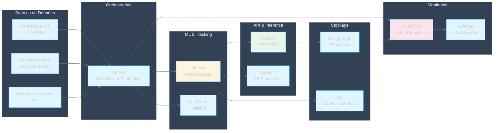

# Documentation MLOps - Jinsudai

Bienvenue dans la documentation complète de l'architecture MLOps du projet de prédiction énergétique.

## Vue d'ensemble

Ce projet implémente une architecture MLOps complète pour la prédiction de consommation énergétique et de production solaire, respectant les objectifs suivants :

- **Création d'algorithmes IA** adaptés aux données d'entraînement et conformes aux spécifications
- **Adaptation de l'infrastructure de données** à travers la construction d'API pour accueillir la solution en production
- **Conception de pipelines CI/CD** pour automatiser le déploiement
- **Développement de scripts de réentraînement** pour automatiser le Machine Learning
- **Pilotage de la performance** via des outils de monitoring (Evidently) pour assurer le respect des spécifications en production

## Navigation

Utilisez le menu de gauche pour naviguer entre les différents pipelines et composants de l'architecture.

## Architecture Globale

Cette section présente une vue d'ensemble de l'architecture MLOps avec les sources de données, l'orchestration, le ML & Tracking, l'API & Inference, le Monitoring et le Stockage.

---

## Diagramme

