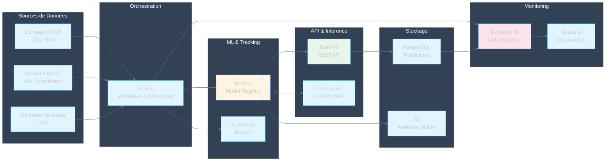
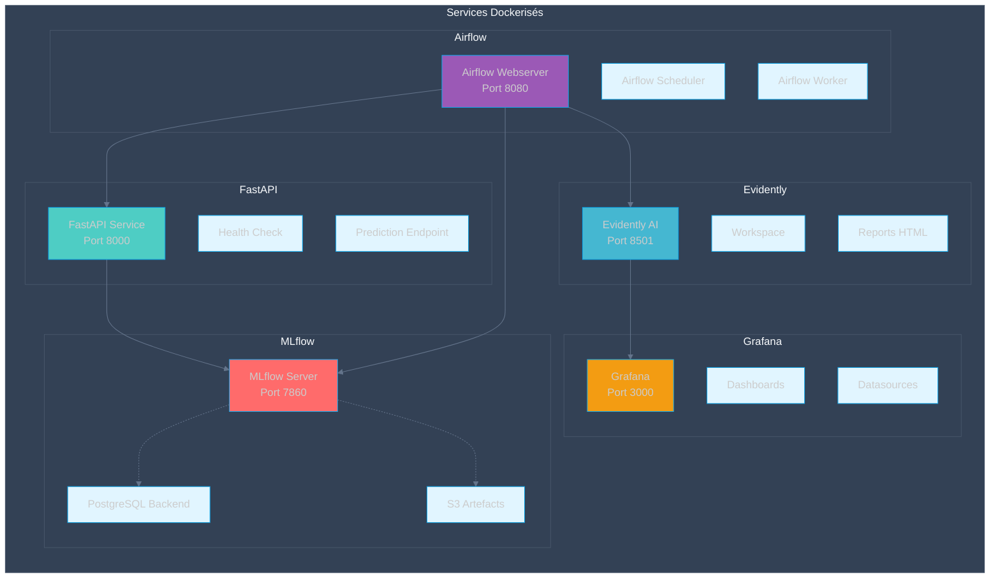
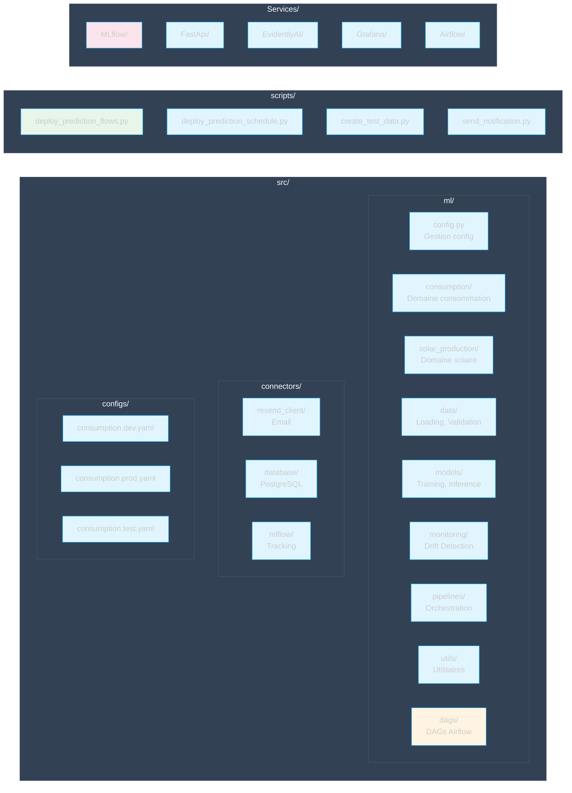
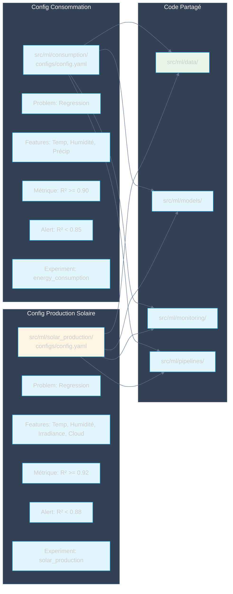
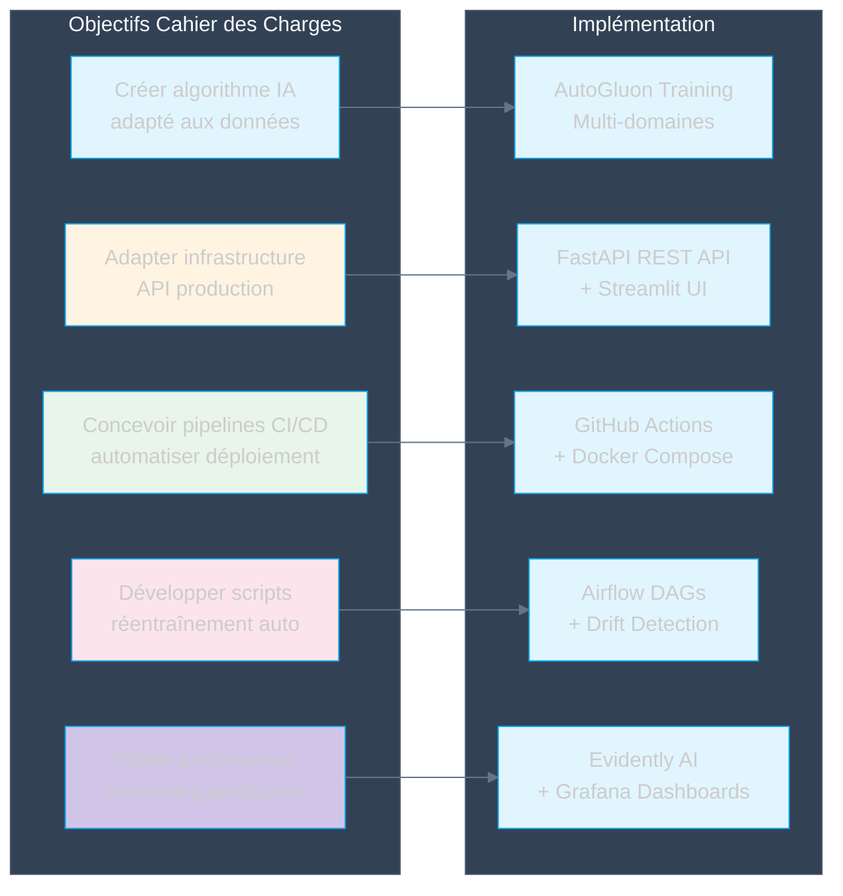
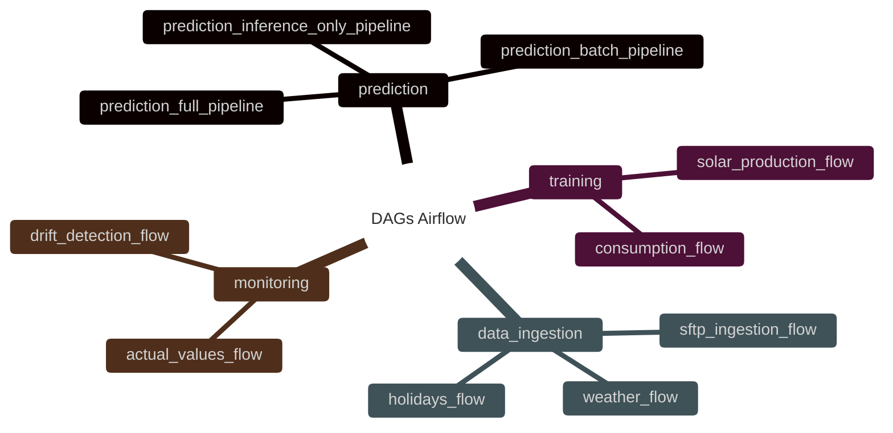
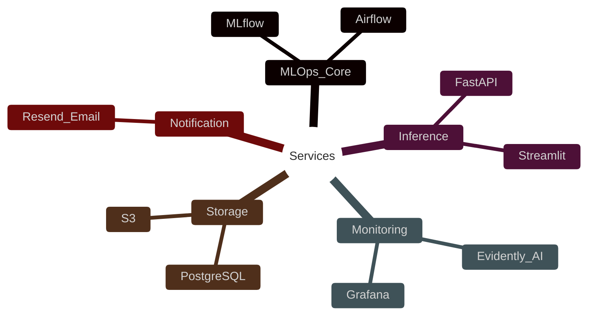

# Architecture Globale

## Vue d'ensemble des composants

Cette section présente une vue d'ensemble des composants de l'architecture MLOps, incluant les sources de données, l'orchestration, le ML & Tracking, l'API & Inference, le Monitoring et le Stockage.

## Architecture détaillée des services

Cette section détaille l'architecture des services dockerisés, incluant MLflow, FastAPI, Evidently, Grafana et Airflow avec leurs composants respectifs.

## Flux de données complet

Cette section présente le flux de données complet depuis les sources externes jusqu'au monitoring, en passant par l'ingestion, le traitement, l'entraînement et l'inférence.

## Structure du code

Cette section décrit la structure du code source, incluant les modules ml, connectors, configs, scripts et Services.

## Différenciation par configuration

Cette section explique comment la configuration différencie les domaines consommation et production solaire, avec du code partagé.

## Flux de données d'entraînement

Cette section détaille le flux de données d'entraînement, depuis les données brutes jusqu'à la promotion en production.

## Flux de données d'inférence

Cette section présente le flux de données d'inférence, depuis la requête API jusqu'à la réponse avec stockage et logging.

## Conformité au Cahier des Charges

### Mapping Objectifs → Implémentation

Cette section mappe les objectifs du cahier des charges vers leur implémentation technique.

### Spécifications techniques respectées

| Spécification | Implémentation | Statut |
|---------------|----------------|--------|
| **Algorithmes IA** | AutoGluon (regression) pour consommation et production solaire | ✅ |
| **Métriques** | R² >= 0.90 (consommation), R² >= 0.92 (solaire) | ✅ |
| **Temps inférence** | < 100ms par requête (FastAPI) | ✅ |
| **API Production** | FastAPI avec endpoints /predict et /predict/batch | ✅ |
| **CI/CD** | GitHub Actions avec Docker + Hugging Face Spaces | ✅ |
| **Réentraînement auto** | Airflow DAGs avec triggers drift + cycle hebdo | ✅ |
| **Monitoring** | Evidently AI + Grafana dashboards | ✅ |
| **Alertes** | Email via Resend + Slack webhooks | ✅ |
| **Stockage modèles** | MLflow Model Registry avec promotion prod | ✅ |
| **Données** | PostgreSQL pour prédictions, S3 pour artefacts | ✅ |

## Résumé des Flows Principaux

Cette section résume les principaux flows Airflow pour les prédictions, l'entraînement, l'ingestion de données et le monitoring.

## Services déployés

Cette section présente les services déployés, incluant le core MLOps, l'inférence, le monitoring, le stockage et les notifications.

---

## Diagrammes

### Vue d'ensemble des composants



### Architecture détaillée des services



### Flux de données complet

```mermaid
%%{init: {'theme': 'dark', 'themeVariables': {'primaryColor': '#e1f5ff', 'primaryTextColor': '#1e293b', 'primaryBorderColor': '#0ea5e9', 'lineColor': '#64748b', 'secondaryColor': '#fff4e1', 'tertiaryColor': '#fce4ec', 'background': '#1e293b', 'mainBkg': '#e1f5ff', 'nodeBorder': '#0ea5e9', 'clusterBkg': '#334155', 'clusterBorder': '#475569', 'titleColor': '#f8fafc', 'edgeLabelBackground': '#1e293b'}}}%%
sequenceDiagram
    participant Source as Sources Externes
    participant Ingest as Ingestion Airflow
    participant Process as Traitement
    participant Train as Training
    participant MLflow as MLflow
    participant API as FastAPI
    participant DB as PostgreSQL
    participant Monitor as Evidently
    
    Source->>Ingest: Données brutes (CSV)
    Ingest->>Process: Validation & Nettoyage
    Process->>Process: Feature Engineering
    Process->>Train: Données préparées
    Train->>Train: Entraînement AutoGluon
    Train->>MLflow: Log métriques & modèle
    MLflow-->>Train: Model URI
    Train->>MLflow: Promotion en production
    
    Note over API,DB: Phase d'Inférence
    
    API->>MLflow: Chargement modèle prod
    MLflow-->>API: Modèle chargé
    API->>API: Prédictions
    API->>DB: Stockage prédictions
    
    Note over DB,Monitor: Phase de Monitoring
    
    DB->>Monitor: Données production
    Monitor->>Monitor: Comparaison référence
    Monitor->>Monitor: Détection drift
    Monitor-->>Train: Trigger retraining
    
    style Source fill:#e1f5ff
    style Train fill:#fff4e1
    style MLflow fill:#d1c4e9
    style Monitor fill:#fce4ec
```

### Structure du code



### Différenciation par configuration



### Flux de données d'entraînement

```mermaid
%%{init: {'theme': 'dark', 'themeVariables': {'primaryColor': '#e1f5ff', 'primaryTextColor': '#1e293b', 'primaryBorderColor': '#0ea5e9', 'lineColor': '#64748b', 'secondaryColor': '#fff4e1', 'tertiaryColor': '#fce4ec', 'background': '#1e293b', 'mainBkg': '#e1f5ff', 'nodeBorder': '#0ea5e9', 'clusterBkg': '#334155', 'clusterBorder': '#475569', 'titleColor': '#f8fafc', 'edgeLabelBackground': '#1e293b'}}}%%
graph LR
    A[Données brutes CSV<br/>data/raw/] --> B[Data Validation<br/>Schéma & Valeurs]
    B --> C[Data Preparation<br/>Nettoyage & Normalisation]
    C --> D[Feature Engineering<br/>Météo + Calendrier]
    D --> E[Split Train/Test<br/>80/20]
    E --> F[Training AutoGluon<br/>Regression]
    F --> G[Évaluation Modèle<br/>R², MAE, RMSE]
    G --> H{Performance OK?}
    H -->|Oui| I[Log MLflow<br/>Métriques + Artefacts]
    H -->|Non| J[Hyperparameter Tuning]
    J --> F
    I --> K[Promotion Production<br/>Alias 'prod']
    K --> L[Modèle en production]

    style B fill:#e1f5ff
    style F fill:#fff4e1
    style G fill:#e8f5e9
    style H fill:#fce4ec
    style I fill:#d1c4e9
```



### Flux de données d'inférence

```mermaid
%%{init: {'theme': 'dark', 'themeVariables': {'primaryColor': '#e1f5ff', 'primaryTextColor': '#1e293b', 'primaryBorderColor': '#0ea5e9', 'lineColor': '#64748b', 'secondaryColor': '#fff4e1', 'tertiaryColor': '#fce4ec', 'background': '#1e293b', 'mainBkg': '#e1f5ff', 'nodeBorder': '#0ea5e9', 'clusterBkg': '#334155', 'clusterBorder': '#475569', 'titleColor': '#f8fafc', 'edgeLabelBackground': '#1e293b'}}}%%
graph LR
    A[Requête API<br/>Features météo + calendrier] --> B[Validation Input<br/>Schéma & Ranges]
    B --> C{Valid?}
    C -->|Non| D[Rejet 400 Bad Request]
    C -->|Oui| E[Chargement Modèle<br/>MLflow Registry]
    E --> F[Prédictions<br/>AutoGluon Inference]
    F --> G[Formatage Output<br/>kWh + Timestamp]
    G --> H[Stockage PostgreSQL<br/>Table predictions]
    H --> I[Logging MLflow<br/>Run ID + Métriques]
    I --> J[Response 200 OK<br/>Prédiction retournée]

    style B fill:#e1f5ff
    style C fill:#fce4ec
    style F fill:#fff4e1
    style H fill:#e8f5e9
    style J fill:#d1c4e9
```



### Mapping Objectifs → Implémentation



### Résumé des Flows Principaux



### Services déployés


