# Pipeline CI/CD

## Vue d'ensemble

Le pipeline CI/CD automatise le build, le test, et le déploiement des services sur Hugging Face Spaces via GitHub Actions.

## Pipeline GitHub Actions

```mermaid
%%{init: {'theme': 'dark', 'themeVariables': {'primaryColor': '#e1f5ff', 'primaryTextColor': '#1e293b', 'primaryBorderColor': '#0ea5e9', 'lineColor': '#64748b', 'secondaryColor': '#fff4e1', 'tertiaryColor': '#fce4ec', 'background': '#1e293b', 'mainBkg': '#e1f5ff', 'nodeBorder': '#0ea5e9', 'clusterBkg': '#334155', 'clusterBorder': '#475569', 'titleColor': '#f8fafc', 'edgeLabelBackground': '#1e293b'}}}%%
graph LR
    A[Push sur main] --> B[GitHub Actions Trigger]
    B --> C[Linting & Tests]
    C --> D{Tests OK?}
    D -->|Non| E[Échec CI]
    D -->|Oui| F[Build Docker Images]
    F --> G[Push Registry]
    G --> H[Deploy MLflow]
    H --> I[Deploy FastAPI]
    I --> J[Deploy Evidently]
    J --> K[Deploy Grafana]
    K --> L[Integration Tests]
    L --> M{Integration OK?}
    M -->|Non| E
    M -->|Oui| N[Deploy Production]
    N --> O[Health Checks]
    O --> P[Notification Success]
    
    style C fill:#e1f5ff
    style F fill:#fff4e1
    style M fill:#fce4ec
    style O fill:#e8f5e9
```



## Workflow de déploiement

```mermaid
%%{init: {'theme': 'dark', 'themeVariables': {'primaryColor': '#e1f5ff', 'primaryTextColor': '#1e293b', 'primaryBorderColor': '#0ea5e9', 'lineColor': '#64748b', 'secondaryColor': '#fff4e1', 'tertiaryColor': '#fce4ec', 'background': '#1e293b', 'mainBkg': '#e1f5ff', 'nodeBorder': '#0ea5e9', 'clusterBkg': '#334155', 'clusterBorder': '#475569', 'titleColor': '#f8fafc', 'edgeLabelBackground': '#1e293b'}}}%%
sequenceDiagram
    participant Dev as Développeur
    participant GH as GitHub
    participant HF as Hugging Face
    participant MLflow as MLflow Service
    participant API as FastAPI
    participant Mon as Monitoring
    
    Dev->>GH: Push code + tag
    GH->>GH: CI/CD Pipeline
    GH->>HF: Deploy MLflow Space
    HF-->>GH: URL MLflow
    GH->>HF: Deploy FastAPI Space
    HF-->>GH: URL API
    GH->>HF: Deploy Evidently Space
    HF-->>GH: URL Evidently
    GH->>MLflow: Health Check
    MLflow-->>GH: 200 OK
    GH->>API: Health Check
    API-->>GH: 200 OK
    GH->>Mon: Configure Dashboards
    Mon-->>GH: Ready
    GH-->>Dev: Deployment Success
    
    style MLflow fill:#fce4ec
    style API fill:#fff4e1
    style Mon fill:#e1f5ff
    style Dev fill:#e8f5e9
```

## Services déployés

### MLflow
- **Port**: 7860
- **Backend**: PostgreSQL
- **Storage**: S3 pour artefacts
- **Health Check**: `/health`

### FastAPI
- **Port**: 8000
- **Endpoints**: `/predict`, `/predict/batch`, `/health`
- **Health Check**: `/health`

### Evidently AI
- **Port**: 8501
- **Workspace**: Rapports drift
- **Health Check**: `/health`

### Grafana
- **Port**: 3000
- **Dashboards**: Monitoring ML
- **Health Check**: `/api/health`

### Airflow
- **Port**: 8080
- **Components**: Webserver, Scheduler, Worker
- **Health Check**: `/health`
