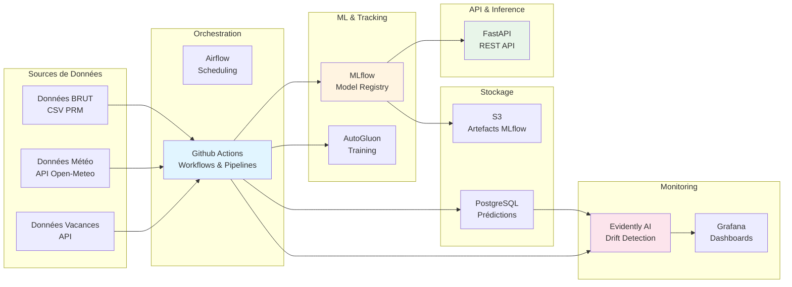
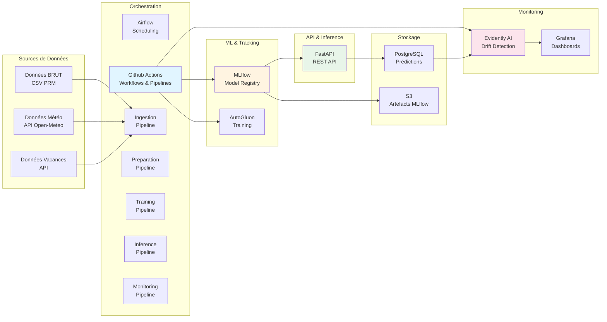

# Architecture Globale

```mermaid
graph LR
    subgraph "Sources de Données"
        A[Données BRUT<br/>CSV PRM]
        B[Données Météo<br/>API Open-Meteo]
        C[Données Vacances<br/>API]
    end

    subgraph "Orchestration"
        Air[Airflow<br/>Scheduling]
        D[Github Actions<br/>Workflows & Pipelines]
    end

    subgraph "ML & Tracking"
        F[MLflow<br/>Model Registry]
        G[AutoGluon<br/>Training]
    end

    subgraph "API & Inference"
        H[FastAPI<br/>REST API]
    end

    subgraph "Monitoring"
        J[Evidently AI<br/>Drift Detection]
        K[Grafana<br/>Dashboards]
    end

    subgraph "Stockage"
        L[PostgreSQL<br/>Prédictions]
        M[S3<br/>Artefacts MLflow]
    end

    A --> D
    B --> D
    C --> D
    D --> F
    D --> G
    F --> H
    D --> L
    D --> J
    J --> K
    F --> M
    L --> J

    style D fill:#e1f5ff
    style F fill:#fff4e1
    style H fill:#e8f5e9
    style J fill:#fce4ec
```

# Architecture Globale

# Architecture Globale
# Architecture Globale

# Architecture Globale

# Architecture Globale

# Architecture Globale

```mermaid
graph LR
    subgraph "Sources de Données"
        A[Données BRUT<br/>CSV PRM]
        B[Données Météo<br/>API Open-Meteo]
        C[Données Vacances<br/>API]
    end

    subgraph "Orchestration"
        Air[Airflow<br/>Scheduling]
        D[Github Actions<br/>Workflows & Pipelines]
        D1[Ingestion<br/>Pipeline]
        D2[Preparation<br/>Pipeline]
        D3[Training<br/>Pipeline]
        D4[Inference<br/>Pipeline]
        D5[Monitoring<br/>Pipeline]
    end

    subgraph "ML & Tracking"
        F[MLflow<br/>Model Registry]
        G[AutoGluon<br/>Training]
    end

    subgraph "API & Inference"
        H[FastAPI<br/>REST API]
    end

    subgraph "Monitoring"
        J[Evidently AI<br/>Drift Detection]
        K[Grafana<br/>Dashboards]
    end

    subgraph "Stockage"
        L[PostgreSQL<br/>Prédictions]
        M[S3<br/>Artefacts MLflow]
    end

    A --> D1
    B --> D1
    C --> D1
    D --> F
    D --> G
    F --> H
    H --> L
    D --> J
    J --> K
    F --> M
    L --> J

    style D fill:#e1f5ff
    style F fill:#fff4e1
    style H fill:#e8f5e9
    style J fill:#fce4ec
```
