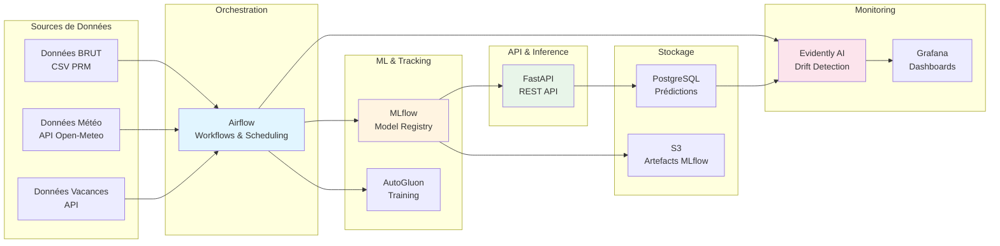
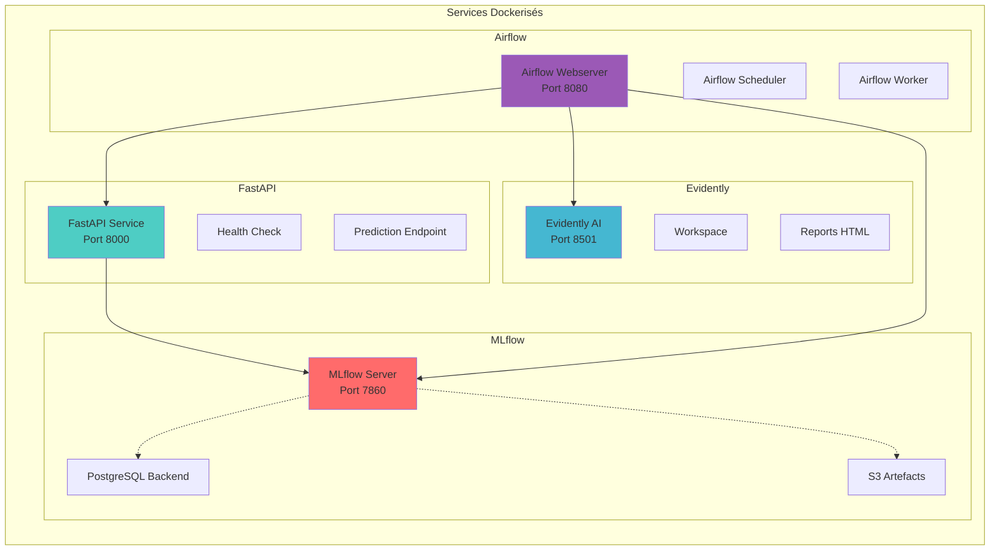
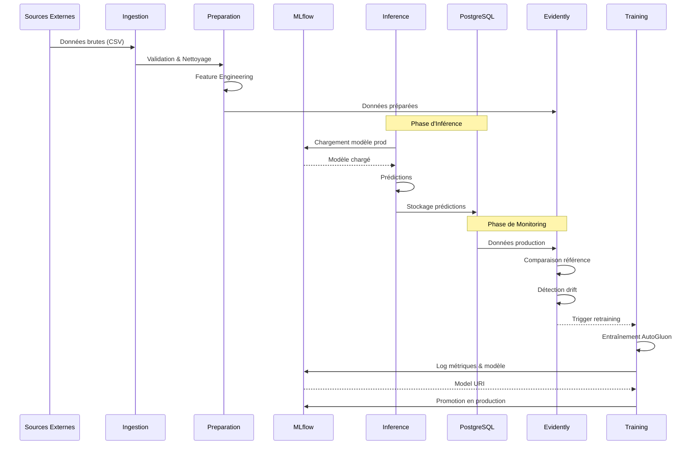
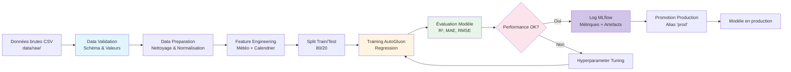
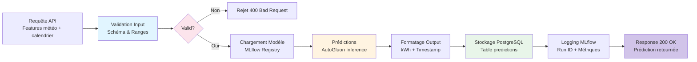
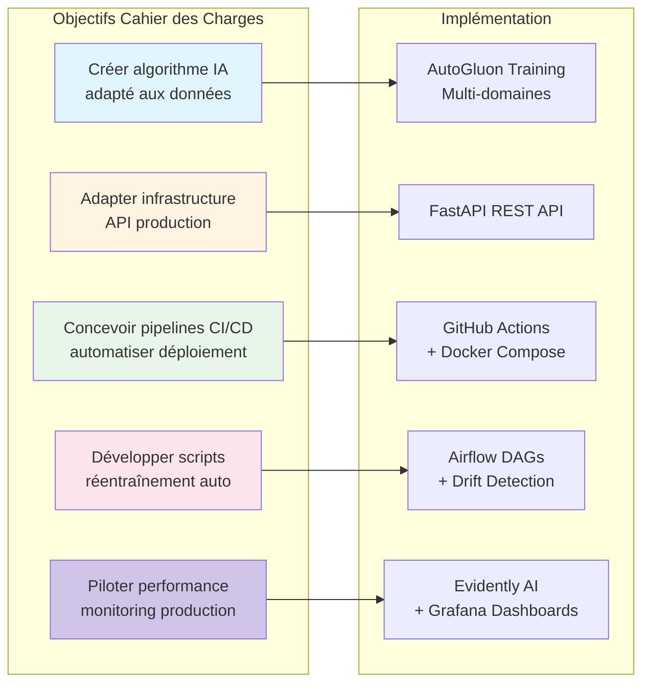

# Architecture Globale

## Vue d'ensemble des composants

## Architecture détaillée des services

## Flux de données complet (A finaliser)

## Flux de données d'entraînement (à finaliser)

## Flux de données d'inférence (à finaliser)

## Conformité au Cahier des Charges

### Mapping Objectifs → Implémentation

