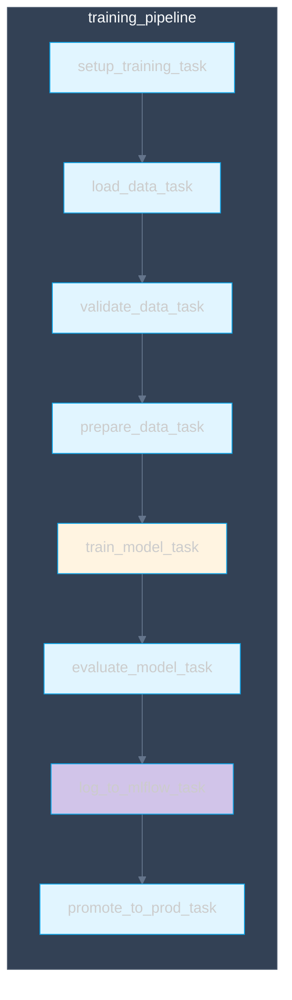

# Pipeline d'Entraînement

## Vue d'ensemble

Le pipeline d'entraînement prépare les données, entraîne les modèles avec AutoGluon, et déploie les meilleurs modèles en production via MLflow.

## DAG Airflow d'entraînement

## Pipeline d'entraînement détaillé

```mermaid
%%{init: {'theme': 'dark', 'themeVariables': {'primaryColor': '#e1f5ff', 'primaryTextColor': '#1e293b', 'primaryBorderColor': '#0ea5e9', 'lineColor': '#64748b', 'secondaryColor': '#fff4e1', 'tertiaryColor': '#fce4ec', 'background': '#1e293b', 'mainBkg': '#e1f5ff', 'nodeBorder': '#0ea5e9', 'clusterBkg': '#334155', 'clusterBorder': '#475569', 'titleColor': '#f8fafc', 'edgeLabelBackground': '#1e293b'}}}%%
graph LR
    subgraph "Phase 1: Préparation"
        P1[Chargement Config] --> P2[Connexion MLflow]
        P2 --> P3[Chargement Données]
        P3 --> P4[Validation]
        P4 --> P5[Nettoyage]
        P5 --> P6[Feature Engineering]
    end
    
    subgraph "Phase 2: Training"
        P6 --> T1[Split Train/Test]
        T1 --> T2[AutoGluon Fit]
        T2 --> T3[Hyperparameter Tuning]
        T3 --> T4[Best Model Selection]
    end
    
    subgraph "Phase 3: Évaluation"
        T4 --> E1[Calcul Métriques]
        E1 --> E2[R² >= 0.90?]
        E2 -->|Oui| E3[Validation OK]
        E2 -->|Non| E4[Retrying]
    end
    
    subgraph "Phase 4: Déploiement"
        E3 --> D1[Log MLflow]
        D1 --> D2[Save Model]
        D2 --> D3[Register Model]
        D3 --> D4[Promote to Prod]
    end
    
    style P1 fill:#e1f5ff
    style T2 fill:#fff4e1
    style E2 fill:#fce4ec
    style D4 fill:#e8f5e9
```

## Flux de données d'entraînement

```mermaid
%%{init: {'theme': 'dark', 'themeVariables': {'primaryColor': '#e1f5ff', 'primaryTextColor': '#1e293b', 'primaryBorderColor': '#0ea5e9', 'lineColor': '#64748b', 'secondaryColor': '#fff4e1', 'tertiaryColor': '#fce4ec', 'background': '#1e293b', 'mainBkg': '#e1f5ff', 'nodeBorder': '#0ea5e9', 'clusterBkg': '#334155', 'clusterBorder': '#475569', 'titleColor': '#f8fafc', 'edgeLabelBackground': '#1e293b'}}}%%
graph LR
    A[Données brutes CSV<br/>data/raw/] --> B[Data Validation<br/>Schéma & Valeurs]
    B --> C[Data Preparation<br/>Nettoyage & Normalisation]
    C --> D[Feature Engineering<br/>Météo + Calendrier]
    D --> E[Split Train/Test<br/>80/20]
    E --> F[Training AutoGluon<br/>Regression]
    F --> G[Évaluation Modèle<br/>R², MAE, RMSE]
    G --> H{Performance OK?}
    H -->|Oui| I[Log MLflow<br/>Métriques + Artefacts]
    H -->|Non| J[Hyperparameter Tuning]
    J --> F
    I --> K[Promotion Production<br/>Alias 'prod']
    K --> L[Modèle en production]
    
    style B fill:#e1f5ff
    style F fill:#fff4e1
    style G fill:#e8f5e9
    style H fill:#fce4ec
    style I fill:#d1c4e9
```

## Métriques par domaine

### Consommation Électrique
- **R² cible**: >= 0.90
- **R² alerte**: < 0.85
- **Métriques**: R², MAE, RMSE

### Production Solaire
- **R² cible**: >= 0.92
- **R² alerte**: < 0.88
- **Métriques**: R², MAE, RMSE
