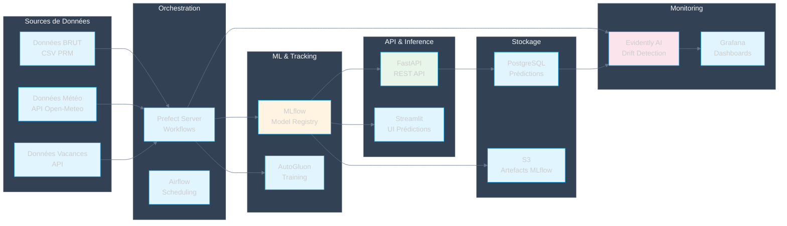
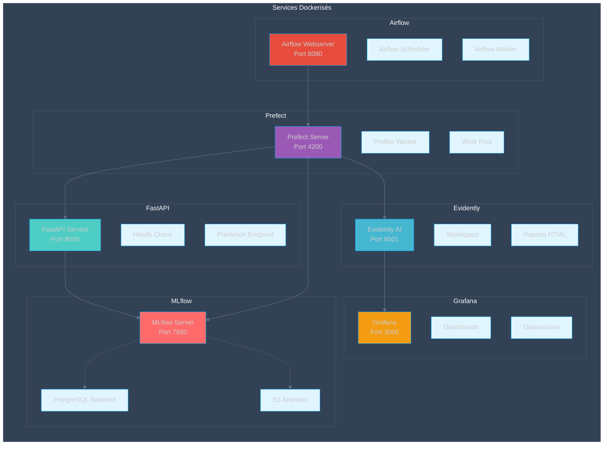
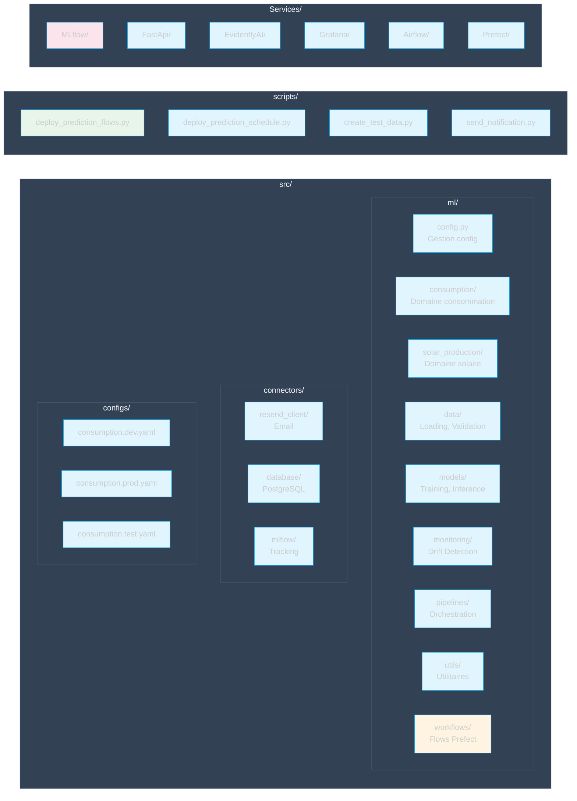
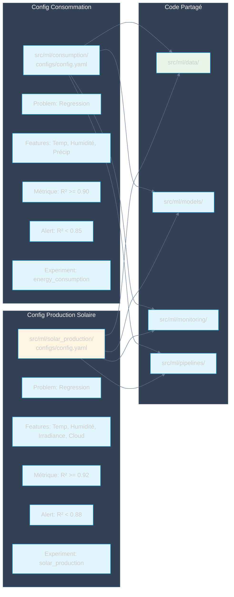

# Architecture Globale

## Vue d'ensemble des composants



## Architecture détaillée des services



## Flux de données complet

```mermaid
%%{init: {'theme': 'dark', 'themeVariables': {'primaryColor': '#e1f5ff', 'primaryTextColor': '#1e293b', 'primaryBorderColor': '#0ea5e9', 'lineColor': '#64748b', 'secondaryColor': '#fff4e1', 'tertiaryColor': '#fce4ec', 'background': '#1e293b', 'mainBkg': '#e1f5ff', 'nodeBorder': '#0ea5e9', 'clusterBkg': '#334155', 'clusterBorder': '#475569', 'titleColor': '#f8fafc', 'edgeLabelBackground': '#1e293b'}}}%%
sequenceDiagram
    participant Source as Sources Externes
    participant Ingest as Ingestion Prefect
    participant Process as Traitement
    participant Train as Training
    participant MLflow as MLflow
    participant API as FastAPI
    participant DB as PostgreSQL
    participant Monitor as Evidently
    
    Source->>Ingest: Données brutes (CSV)
    Ingest->>Process: Validation & Nettoyage
    Process->>Process: Feature Engineering
    Process->>Train: Données préparées
    Train->>Train: Entraînement AutoGluon
    Train->>MLflow: Log métriques & modèle
    MLflow-->>Train: Model URI
    Train->>MLflow: Promotion en production
    
    Note over API,DB: Phase d'Inférence
    
    API->>MLflow: Chargement modèle prod
    MLflow-->>API: Modèle chargé
    API->>API: Prédictions
    API->>DB: Stockage prédictions
    
    Note over DB,Monitor: Phase de Monitoring
    
    DB->>Monitor: Données production
    Monitor->>Monitor: Comparaison référence
    Monitor->>Monitor: Détection drift
    Monitor-->>Train: Trigger retraining
    
    style Source fill:#e1f5ff
    style Train fill:#fff4e1
    style MLflow fill:#d1c4e9
    style Monitor fill:#fce4ec
```

## Structure du code



## Différenciation par configuration


