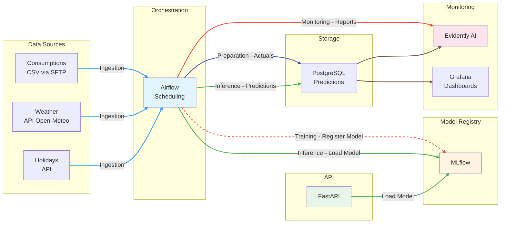

# Architecture Globale

```mermaid
graph LR
    subgraph "Data Sources"
        A[Consumptions<br/>CSV via SFTP]
        B[Weather<br/>API Open-Meteo]
        C[Holidays<br/>API]
    end

    subgraph "Orchestration"
        D[Airflow<br/>Scheduling]
    end

    subgraph "Model Registry"
        F[MLflow]
    end

    subgraph "API"
        H[FastAPI]
    end

    subgraph "Monitoring"
        J[Evidently AI]
        K[Grafana<br/>Dashboards]
    end

    subgraph "Storage"
        L[PostgreSQL<br/>Predictions]
    end

    A -->|Ingestion| D
    B -->|Ingestion| D
    C -->|Ingestion| D
    D -..->|Training - Register Model| F
    D -->|Inference - Load Model| F
    H -->|Load Model| F
    D -->|Preparation - Actuals| L
    D -->|Inference - Predictions| L
    D -->|Monitoring - Reports| J
    L --> K
    L --> J

    %% Ingestion: A,B,C --> D
    linkStyle 0,1,2 stroke:#2196F3,stroke-width:2px
    %% Training: D --> F
    linkStyle 3 stroke:#F44336,stroke-width:2px,stroke-dasharray: 5 5
    %% Inference: F --> D
    linkStyle 4,7 stroke:#4CAF50,stroke-width:2px
    %% EndPoint: F --> H
    linkStyle 5 stroke:#4CAF50,stroke-width:2px
    %% Preparation: D --> L
    linkStyle 6 stroke:#3F51B5,stroke-width:2px
    %% Monitoring: D --> J
    linkStyle 8 stroke:#F44336,stroke-width:2px
    %% Dashboards: L --> K, L --> J
    linkStyle 9,10 stroke:#795548,stroke-width:2px

    style D fill:#e1f5ff
    style F fill:#fff4e1
    style H fill:#e8f5e9
    style J fill:#fce4ec
```

