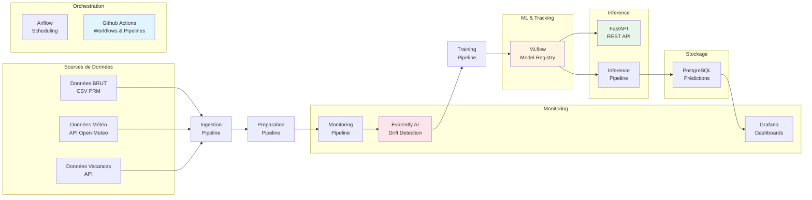

# Architecture Totale

```mermaid
graph LR
    subgraph "Sources de Données"
        A[Données BRUT<br/>CSV PRM]
        B[Données Météo<br/>API Open-Meteo]
        C[Données Vacances<br/>API]
    end

    subgraph "Orchestration"
        Air[Airflow<br/>Scheduling]
        D[Github Actions<br/>Workflows & Pipelines]

    end

    D1[Ingestion<br/>Pipeline]
    D2[Preparation<br/>Pipeline]
    D3[Training<br/>Pipeline]
    
    

    subgraph "ML & Tracking"
        F[MLflow<br/>Model Registry]
    end

    subgraph "Inference"
        H[FastAPI<br/>REST API]
        D4[Inference<br/>Pipeline]
    end

    subgraph "Monitoring"
        D5[Monitoring<br/>Pipeline]
        J[Evidently AI<br/>Drift Detection]
        K[Grafana<br/>Dashboards]
    end

    subgraph "Stockage"
        L[PostgreSQL<br/>Prédictions]
    end

    A --> D1
    B --> D1
    C --> D1
    D1 --> D2
    D2 --> D5
    D3 --> F
    F --> D4
    F --> H
    D4 --> L
    D5 --> J
    L --> K
    J --> D3

    style D fill:#e1f5ff
    style F fill:#fff4e1
    style H fill:#e8f5e9
    style J fill:#fce4ec
```
