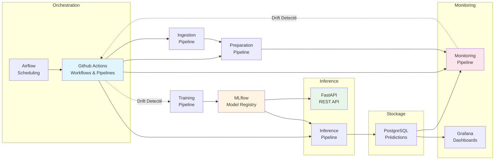

# ML Pipeline

```mermaid
graph LR

    subgraph "Orchestration"
        Air[Airflow<br/>Scheduling]
        D[Github Actions<br/>Workflows & Pipelines]
    end

    Air --> D
    D5 -. Drift Detecté .-> D

    D1[Ingestion<br/>Pipeline]
    D2[Preparation<br/>Pipeline]
    D3[Training<br/>Pipeline]
    
    
    F[MLflow<br/>Model Registry]

    subgraph "Inference"
        H[FastAPI<br/>REST API]
        D4[Inference<br/>Pipeline]
    end

    subgraph "Monitoring"
        D5[Monitoring<br/>Pipeline]
        K[Grafana<br/>Dashboards]
    end

    subgraph "Stockage"
        L[PostgreSQL<br/>Prédictions]
    end

    L --> D5

    D3 --> F

    D --> D1
    D --> D2

    D --> D4
    D --> D5

    D1 --> D2
    D2 --> D5

    F --> D4
    F --> H
    D4 --> L
    L --> K
    D -. Drift Detecté .-> D3

    style D fill:#e1f5ff
    style F fill:#fff4e1
    style H fill:#e8f5e9
    style D5 fill:#fce4ec
```
