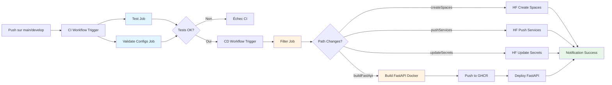
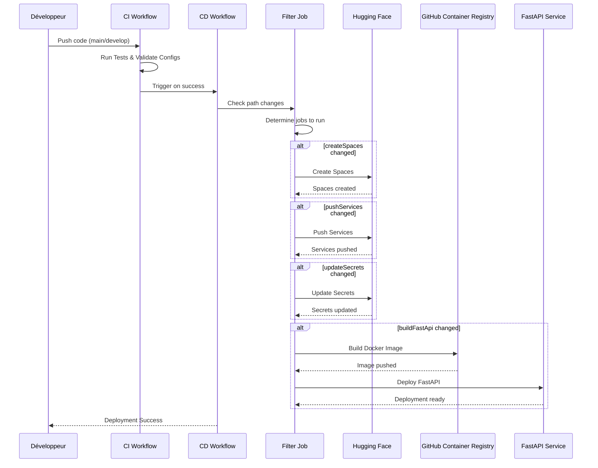

# Pipeline CI/CD

## Vue d'ensemble

Le pipeline CI/CD automatise le build, le test, et le déploiement des services sur Hugging Face Spaces via GitHub Actions.

## Pipeline GitHub Actions

## Workflow de déploiement

## Services déployés (A déplacer?)

### MLflow
- **Port**: 7860
- **Backend**: PostgreSQL
- **Storage**: S3 pour artefacts
- **Health Check**: `/health`

### FastAPI
- **Port**: 8000
- **Endpoints**: `/predict`, `/predict/batch`, `/health`
- **Health Check**: `/health`

### Evidently AI
- **Port**: 8501
- **Workspace**: Rapports drift
- **Health Check**: `/health`

### Grafana
- **Port**: 3000
- **Dashboards**: Monitoring ML
- **Health Check**: `/api/health`

### Airflow
- **Port**: 8080
- **Components**: Webserver, Scheduler, Worker
- **Health Check**: `/health`
