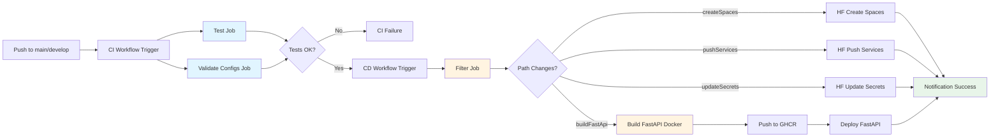

# Pipeline CI/CD

## Vue d'ensemble

Le pipeline CI/CD automatise le build, le test, et le déploiement des services sur Hugging Face Spaces via GitHub Actions.

## Pipeline GitHub Actions

## Workflow de déploiement

## Services déployés

### MLflow
- **Backend**: PostgreSQL
- **Storage**: S3 pour artefacts
- **Health Check**: `/health`
- **URL**: https://jinsudai-mlflow.hf.space/

### FastAPI (JinsudAPI)
- **Endpoints**: `/predict`, `/predict/batch`, `/health`
- **Health Check**: `/health`
- **URL**: https://jetestai-jinsudapi.hf.space/

### EvidentlyUI
- **Workspace**: Rapports drift
- **Health Check**: `/health`
- **URL**: https://evidentlai-evidentlyui.hf.space/

### Airflow
- **Components**: Webserver, Scheduler, Worker
- **Health Check**: `/health`
- **URL**: https://airflai-airflow.hf.space/
