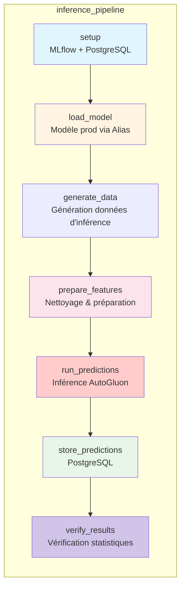

# Pipeline d'Inférence

## Vue d'ensemble

Le pipeline d'inférence charge les modèles en production, génère des prédictions, et stocke les résultats dans PostgreSQL avec monitoring de drift.

## Pipeline d'Inférence

## Endpoints FastAPI

### POST /predict
- **Description**: Prédiction individuelle
- **Input**: Features météo + calendrier
- **Output**: Prédiction kWh + timestamp
- **Temps de réponse**: < 100ms

### POST /predict/batch
- **Description**: Prédictions par lot
- **Input**: Array de features
- **Output**: Array de prédictions
- **Temps de réponse**: < 500ms (100 items)