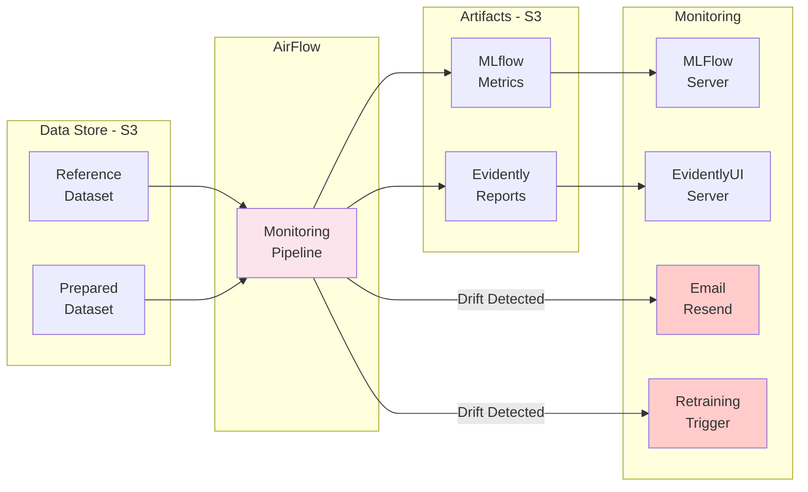

# Monitoring et Drift Detection

## Vue d'ensemble

Le monitoring utilise Evidently AI pour détecter le drift des données et des prédictions, avec alertes automatiques et triggering de retraining.

## Architecture de monitoring

## Drifts détectés

### Data Drift
- **Définition**: Changement dans la distribution des features d'entrée
- **Détection**: Test Kolmogorov-Smirnov, PSI
- **Action**: Rejet des prédictions si drift sévère

### Concept Drift
- **Définition**: Changement dans la relation features/target
- **Détection**: Comparaison des distributions de prédictions
- **Action**: Trigger retraining automatique

### Prediction Drift
- **Définition**: Changement dans la distribution des prédictions
- **Détection**: Analyse des résidus
- **Action**: Monitoring accru, alertes
