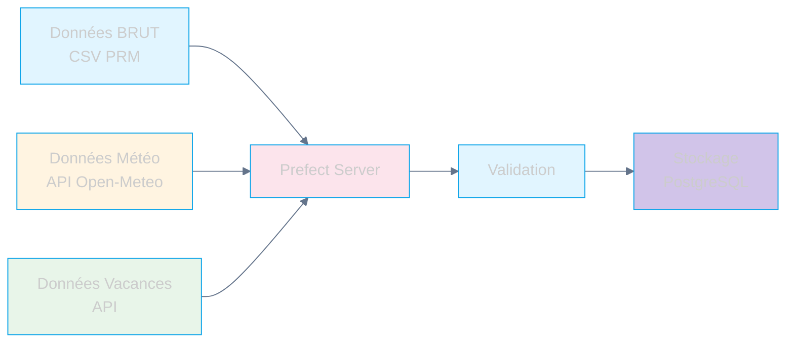
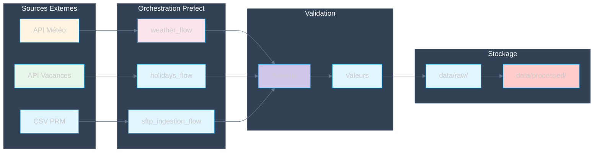

# Pipeline d'Ingestion des Données

## Vue d'ensemble

Le pipeline d'ingestion collecte les données depuis différentes sources externes et les prépare pour le traitement.

## Sources de Données

## Flux d'Ingestion

## Workflows Prefect

### weather_flow
- **Source**: API Open-Meteo
- **Fréquence**: Quotidienne
- **Output**: Données météorologiques (température, humidité, précipitations)

### holidays_flow
- **Source**: API vacances
- **Fréquence**: Mensuelle
- **Output**: Calendrier des jours fériés

### sftp_ingestion_flow
- **Source**: SFTP (CSV PRM)
- **Fréquence**: Quotidienne
- **Output**: Données de consommation brutes
