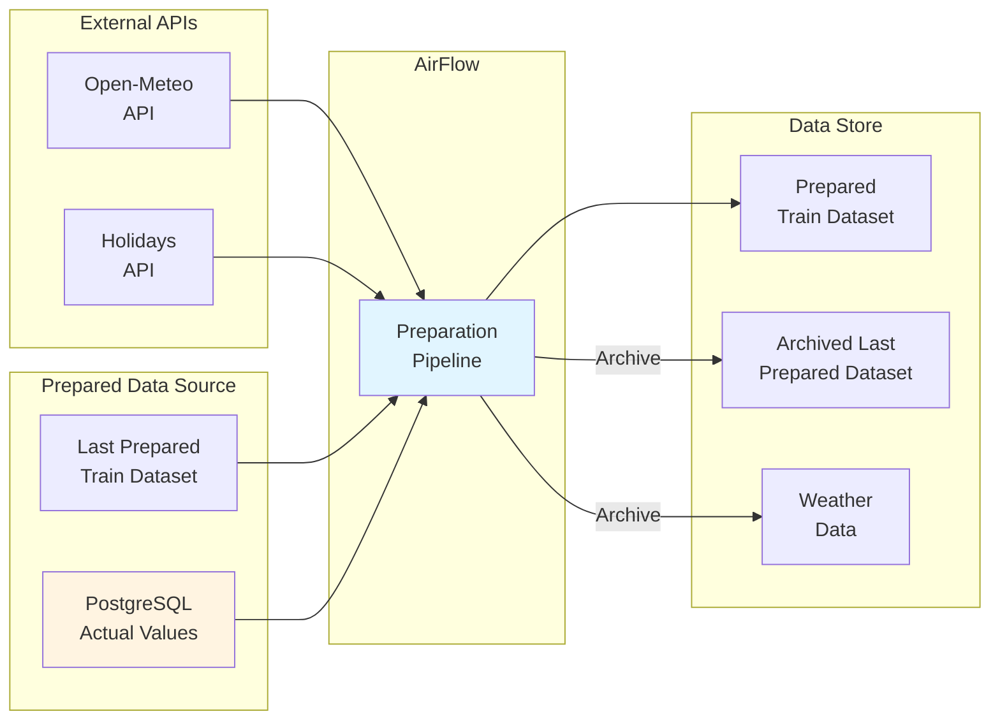

# Pipeline de Préparation

Le pipeline de préparation télécharge les données existantes, génère les features météo et vacances, fusionne avec les données brutes, récupère les valeurs réelles depuis la base de données, et sauvegarde le tout sur S3.

**Sources de données :**
- **Raw CSV** : Uniquement pour le premier entraînement initial
- **PostgreSQL** : Pour les entraînements suivants (données mises à jour par le pipeline d'ingestion)

## Flux de données




## API Météo
**Fichier** : `src/ml/connectors/weather/weather_api.py`
**Classe** : `WeatherAPI`
**Source** : API Open-Meteo (données historiques et prévisions)
**Colonnes générées** :
- `temperature_2m_mean` : Température moyenne
- `relative_humidity_mean` : Humidité relative moyenne
- `precipitation_sum` : Précipitations cumulées
**Fonctionnalités** :
- Récupération des données historiques
- Récupération des prévisions (jusqu'à 16 jours)
- Validation des données (valeurs manquantes, plages normales)
- Export en Parquet ou CSV
**Exemple d'utilisation** :
```python
from ml.connectors.weather.weather_api import WeatherAPI
api = WeatherAPI(latitude=48.8566, longitude=2.3522, location_name="Paris")
# Données historiques
df = api.fetch_historical("2024-01-01", "2024-01-31", hourly=True)
# Prévisions
df = api.fetch_forecast(forecast_days=7, hourly=True)
# Générer Parquet
api.generate_parquet(output_path="data/processed/")
```


## API Vacances et Jours Fériés
**Fichier** : `src/ml/connectors/holidays/holidays_api.py`
**Classes** :
- `VacancesAPI` : Vacances scolaires par zone (A, B, C)
- `JoursFeriesAPI` : Jours fériés en France métropolitaine
- `HolidaysCombinedAPI` : API combinée vacances + jours fériés
**Sources** :
- Vacances scolaires : GitHub (AntoineAugusti/vacances-scolaires)
- Jours fériés : API Gouv (calendrier.api.gouv.fr)
**Colonnes générées** :
- `Horodate` : Timestamp
- `is_vacances` : 1 si vacances scolaires
- `nom_vacances` : Nom de la période
- `jour de la semaine` : Jour de la semaine
- `jour férié` : 1 si jour férié
**Exemple d'utilisation** :
```python
from ml.connectors.holidays.holidays_api import HolidaysCombinedAPI
api = HolidaysCombinedAPI(zone="C")
# Générer DataFrame complet
df = api.generate_holidays_dataframe("2024-01-01", "2024-12-31")
# Générer Parquet (non utilisé)
api.generate_parquet("2024-01-01", "2024-12-31", "data/processed/holidays.parquet")
```