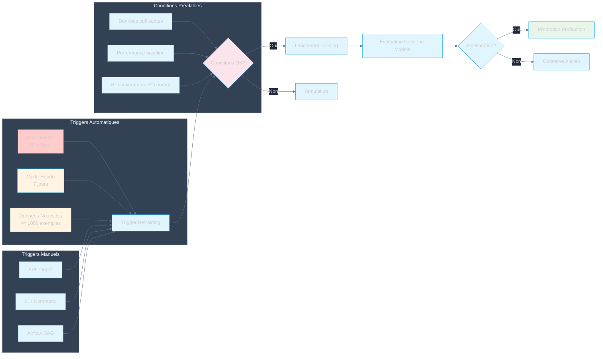

# Automatisation du Retraining

## Vue d'ensemble

L'automatisation du retraining utilise des triggers automatiques et manuels pour lancer le retraining des modèles lorsque nécessaire, avec validation avant déploiement.

## Triggers de retraining



## Workflow de retraining automatisé

```mermaid
%%{init: {'theme': 'dark', 'themeVariables': {'primaryColor': '#e1f5ff', 'primaryTextColor': '#1e293b', 'primaryBorderColor': '#0ea5e9', 'lineColor': '#64748b', 'secondaryColor': '#fff4e1', 'tertiaryColor': '#fce4ec', 'background': '#1e293b', 'mainBkg': '#e1f5ff', 'nodeBorder': '#0ea5e9', 'clusterBkg': '#334155', 'clusterBorder': '#475569', 'titleColor': '#f8fafc', 'edgeLabelBackground': '#1e293b'}}}%%
sequenceDiagram
    participant Monitor as Evidently
    participant Trigger as Prefect Trigger
    participant Train as Training Flow
    participant MLflow as MLflow
    participant Eval as Evaluation
    participant Prod as Production
    
    Monitor->>Monitor: Détection Drift
    Monitor->>Trigger: Signal Retraining
    Trigger->>Train: Lancement Flow
    Train->>Train: Chargement Données
    Train->>Train: Training AutoGluon
    Train->>MLflow: Log Nouveau Modèle
    MLflow-->>Train: Model URI
    Train->>Eval: Évaluation
    Eval->>Eval: Comparaison Baseline
    Eval-->>Train: Résultats
    Train->>Train: Décision Promotion
    Train->>MLflow: Promotion Prod
    MLflow-->>Prod: Nouveau Modèle
    Prod->>Prod: Déploiement
    Prod-->>Monitor: Monitoring Continu
    
    style Monitor fill:#fce4ec
    style Train fill:#fff4e1
    style MLflow fill:#e1f5ff
    style Prod fill:#e8f5e9
```

## Triggers Automatiques

### Drift Detection
- **Condition**: R² < seuil d'alerte (0.85 consommation, 0.88 solaire)
- **Fréquence**: Après chaque batch de prédictions
- **Action**: Trigger immédiat du retraining

### Cycle Hebdomadaire
- **Condition**: 7 jours depuis dernier retraining
- **Fréquence**: Hebdomadaire
- **Action**: Trigger retraining si nouvelles données disponibles

### Nouvelles Données
- **Condition**: >= 1000 nouveaux exemples
- **Fréquence**: Vérification quotidienne
- **Action**: Trigger retraining si seuil atteint

## Triggers Manuels

### API Trigger
- **Endpoint**: `/retrain`
- **Méthode**: POST
- **Paramètres**: domain (consumption/solar), force (bool)

### CLI Command
- **Commande**: `python scripts/retrain.py --domain consumption`
- **Options**: `--force`, `--dry-run`

### Airflow DAG
- **DAG**: `retraining_dag`
- **Schedule**: Manuel ou cron
- **Paramètres**: domain, force

## Conditions de Validation

### Données suffisantes
- Minimum 1000 exemples
- Distribution représentative
- Pas de valeurs manquantes excessives

### Performance baseline
- R² nouveau >= R² courant
- MAE nouveau <= MAE courant
- RMSE nouveau <= RMSE courant

### Stabilité
- Performance stable sur validation set
- Pas d'overfitting détecté
- Temps d'inférence acceptable
