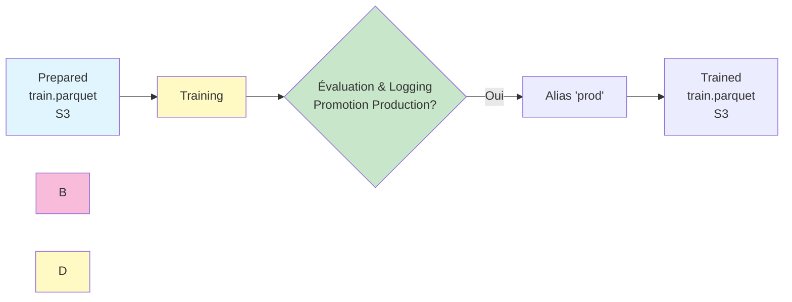
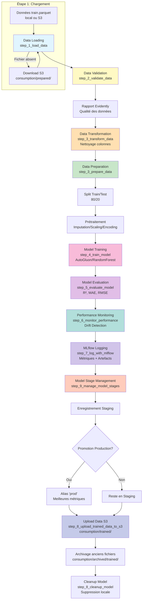

# Pipeline d'Entraînement

## Vue d'ensemble

Le pipeline d'entraînement prépare les données, entraîne les modèles avec AutoGluon, et déploie les meilleurs modèles en production via MLflow.

## Flux de données

### Cycle Préparation → Training → Archivage

1. **Preparation Pipeline** génère des features et upload vers `consumption/prepared/`
2. **Training Pipeline** télécharge depuis `consumption/prepared/` et entraîne le modèle
3. **Training Pipeline** upload vers `consumption/trained/` après entraînement
4. Les anciens fichiers sont archivés dans `consumption/archived/prepared/` et `consumption/archived/trained/`

## Flux de données d'entraînement détaillé

