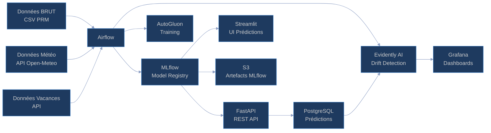
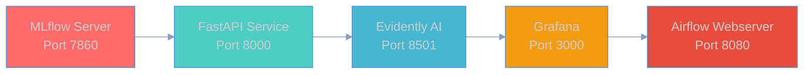
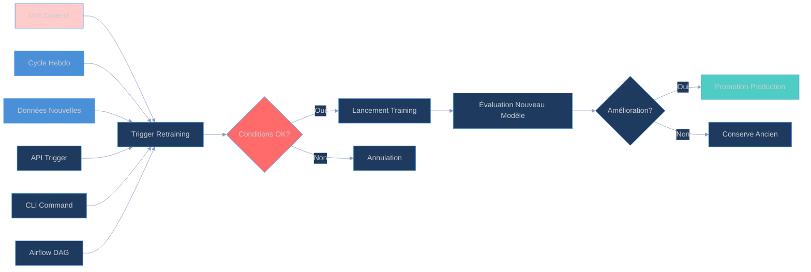

<!-- _class: lead -->

# Architecture MLOps
## Jinsudai - Prédiction Énergétique

---

# Objectifs

- **Création d'algorithmes IA** adaptés aux données d'entraînement
- **Adaptation de l'infrastructure** API pour production
- **Conception de pipelines CI/CD** automatisés
- **Développement de scripts** réentraînement auto
- **Pilotage de la performance** monitoring production

---

# Architecture Globale

---

# Services Dockerisés

---

# Pipeline d'Ingestion

```mermaid
%%{init: {'theme': 'dark', 'themeVariables': {'primaryColor': '#1e3a5f', 'primaryTextColor': '#ffffff', 'primaryBorderColor': '#4a90d9', 'lineColor': '#8b9dc3', 'secondaryColor': '#2d4a6f', 'tertiaryColor': '#3d5a7f', 'background': '#0f172a', 'mainBkg': '#1e3a5f', 'nodeBorder': '#4a90d9', 'clusterBkg': '#1e293b', 'clusterBorder': '#334155', 'titleColor': '#f1f5f9', 'edgeLabelBackground': '#1e3a5f'}}}%%
graph LR
    A[Données BRUT<br/>CSV PRM] --> D[Airflow]
    B[Données Météo<br/>API Open-Meteo] --> D
    C[Données Vacances<br/>API] --> D
    D --> E[Validation]
    E --> F[Stockage<br/>PostgreSQL]
    
    style A fill:#1e3a5f
    style B fill:#2d4a6f
    style C fill:#3d5a7f
    style D fill:#4a90d9
    style F fill:#8b9dc3
```

---

# Pipeline d'Entraînement

---

# Flux d'Entraînement

```mermaid
%%{init: {'theme': 'dark', 'themeVariables': {'primaryColor': '#1e3a5f', 'primaryTextColor': '#ffffff', 'primaryBorderColor': '#4a90d9', 'lineColor': '#8b9dc3', 'secondaryColor': '#2d4a6f', 'tertiaryColor': '#3d5a7f', 'background': '#0f172a', 'mainBkg': '#1e3a5f', 'nodeBorder': '#4a90d9', 'clusterBkg': '#1e293b', 'clusterBorder': '#334155', 'titleColor': '#f1f5f9', 'edgeLabelBackground': '#1e3a5f'}}}%%
graph LR
    A[Données brutes CSV] --> B[Data Validation]
    B --> C[Data Preparation]
    C --> D[Feature Engineering]
    D --> E[Split Train/Test<br/>80/20]
    E --> F[Training AutoGluon]
    F --> G[Évaluation Modèle]
    G --> H{Performance OK?}
    H -->|Oui| I[Log MLflow]
    H -->|Non| J[Hyperparameter Tuning]
    J --> F
    I --> K[Promotion Production]
    
    style B fill:#1e3a5f
    style F fill:#4a90d9
    style G fill:#8b9dc3
    style H fill:#ff6b6b
    style I fill:#4ecdc4
```

---

# Pipeline d'Inférence

```mermaid
%%{init: {'theme': 'dark', 'themeVariables': {'primaryColor': '#1e3a5f', 'primaryTextColor': '#ffffff', 'primaryBorderColor': '#4a90d9', 'lineColor': '#8b9dc3', 'secondaryColor': '#2d4a6f', 'tertiaryColor': '#3d5a7f', 'background': '#0f172a', 'mainBkg': '#1e3a5f', 'nodeBorder': '#4a90d9', 'clusterBkg': '#1e293b', 'clusterBorder': '#334155', 'titleColor': '#f1f5f9', 'edgeLabelBackground': '#1e3a5f'}}}%%
graph LR
    A[setup_prediction_task] --> B[load_model_task]
    B --> C[generate_inference_data_task]
    C --> D[prepare_features_task]
    D --> E[run_predictions_task]
    E --> F[store_predictions_task]
    F --> G[detect_drift_task]
    G --> H{Drift détecté?}
    H -->|Oui| I[retrain_model_task]
    H -->|Non| J[verify_results_task]
    I --> J
    
    style A fill:#1e3a5f
    style E fill:#4a90d9
    style G fill:#ff6b6b
    style I fill:#ffcccb
    style J fill:#4ecdc4
```

---

# Base de Données - PostgreSQL

## Table `predictions_pipeline`

| Colonne | Type | Description |
|---------|------|-------------|
| `prediction_id` | UUID | Identifiant unique (clé primaire) |
| `prediction_timestamp` | TIMESTAMP | Timestamp de la prédiction |
| `prediction` | DOUBLE | Valeur prédite en kWh |
| `model_version` | TEXT | Version du modèle |
| `entity_id` | TEXT | Identifiant entité (client/site) |
| `run_id` | TEXT | ID du run MLflow |
| `actual_value` | DOUBLE | Valeur réelle observée |

**Index** : timestamp, entity_id, run_id

---

# Interactions avec la Base de Données

## Classe `DatabaseHandler`

- `create_tables()` : Création table + index
- `store_predictions()` : Stockage des prédictions
- `get_recent_predictions()` : Récupération récentes
- `get_predictions_by_date()` : Récupération par plage
- `update_actual_values()` : Mise à jour valeurs réelles
- `get_production_data_for_retraining()` : Données pour retraining

**Documentation détaillée** : `docs/DATABASE_SCHEMA.md`

---

# Pipeline CI/CD

```mermaid
%%{init: {'theme': 'dark', 'themeVariables': {'primaryColor': '#1e3a5f', 'primaryTextColor': '#ffffff', 'primaryBorderColor': '#4a90d9', 'lineColor': '#8b9dc3', 'secondaryColor': '#2d4a6f', 'tertiaryColor': '#3d5a7f', 'background': '#0f172a', 'mainBkg': '#1e3a5f', 'nodeBorder': '#4a90d9', 'clusterBkg': '#1e293b', 'clusterBorder': '#334155', 'titleColor': '#f1f5f9', 'edgeLabelBackground': '#1e3a5f'}}}%%
graph LR
    A[Push sur main] --> B[GitHub Actions Trigger]
    B --> C[Linting & Tests]
    C --> D{Tests OK?}
    D -->|Non| E[Échec CI]
    D -->|Oui| F[Build Docker Images]
    F --> G[Push Registry]
    G --> H[Deploy MLflow]
    H --> I[Deploy FastAPI]
    I --> J[Deploy Evidently]
    J --> K[Deploy Grafana]
    K --> L[Integration Tests]
    M --> N{Integration OK?}
    N -->|Non| E
    N -->|Oui| O[Deploy Production]
    O --> P[Health Checks]
    P --> Q[Notification Success]
    
    style C fill:#1e3a5f
    style F fill:#4a90d9
    style M fill:#ff6b6b
    style O fill:#4ecdc4
```

---

# Monitoring et Drift Detection

```mermaid
%%{init: {'theme': 'dark', 'themeVariables': {'primaryColor': '#1e3a5f', 'primaryTextColor': '#ffffff', 'primaryBorderColor': '#4a90d9', 'lineColor': '#8b9dc3', 'secondaryColor': '#2d4a6f', 'tertiaryColor': '#3d5a7f', 'background': '#0f172a', 'mainBkg': '#1e3a5f', 'nodeBorder': '#4a90d9', 'clusterBkg': '#1e293b', 'clusterBorder': '#334155', 'titleColor': '#f1f5f9', 'edgeLabelBackground': '#1e3a5f'}}}%%
graph LR
    A[FastAPI<br/>Prédictions] --> B[PostgreSQL<br/>Historique]
    B --> C[Evidently AI<br/>Drift Detection]
    C --> D[Grafana<br/>Dashboards]
    C --> E[MLflow<br/>Métriques]
    C --> F[Email Resend<br/>Notifications]
    D --> G[Slack/Webhook<br/>Alertes]
    
    style C fill:#ff6b6b
    style D fill:#4a90d9
    style E fill:#1e3a5f
    style F fill:#ffcccb
```

---

# Pipeline de Détection Drift

---

# Automatisation du Retraining

---

# Métriques par Domaine

## Consommation Électrique
- **R² cible**: >= 0.90
- **R² alerte**: < 0.85
- **Métriques**: R², MAE, RMSE

## Production Solaire
- **R² cible**: >= 0.92
- **R² alerte**: < 0.88
- **Métriques**: R², MAE, RMSE

---

# Spécifications Techniques

| Spécification | Implémentation | Statut |
|---------------|----------------|--------|
| Algorithmes IA | AutoGluon (regression) | ✅ |
| Métriques | R² >= 0.90 / 0.92 | ✅ |
| Temps inférence | < 100ms | ✅ |
| API Production | FastAPI endpoints | ✅ |
| CI/CD | GitHub Actions + Docker | ✅ |
| Réentraînement auto | Airflow DAGs | ✅ |
| Monitoring | Evidently AI + Grafana | ✅ |
| Alertes | Email + Slack webhooks | ✅ |

---

# Conclusion

Cette architecture MLOps complète respecte l'intégralité du cahier des charges :

1. **Algorithmes IA adaptés** - AutoGluon avec configurations spécifiques
2. **Infrastructure adaptée** - API FastAPI + UI Streamlit
3. **Pipelines CI/CD** - GitHub Actions automatisés
4. **Scripts réentraînement** - Airflow DAGs avec triggers automatiques
5. **Pilotage performance** - Evidently AI + Grafana

Architecture modulaire, scalable et conforme aux meilleures pratiques MLOps.

---

# Merci

**Questions ?**

---

*Présentation générée avec Marp - Architecture MLOps Jinsudai*
