# Documentation Architecture MLOps - Jinsudai

## Vue d'ensemble

Ce document présente l'architecture MLOps complète du projet de prédiction énergétique, illustrée avec des diagrammes Mermaid. L'architecture est conçue pour respecter le cahier des charges et répondre aux objectifs suivants :

- **Création d'algorithmes IA** adaptés aux données d'entraînement et conformes aux spécifications
- **Adaptation de l'infrastructure de données** à travers la construction d'API pour accueillir la solution en production
- **Conception de pipelines CI/CD** pour automatiser le déploiement
- **Développement de scripts de réentraînement** pour automatiser le Machine Learning
- **Pilotage de la performance** via des outils de monitoring (Evidently) pour assurer le respect des spécifications en production

---

## 1. Architecture Globale

### 1.1 Vue d'ensemble des composants

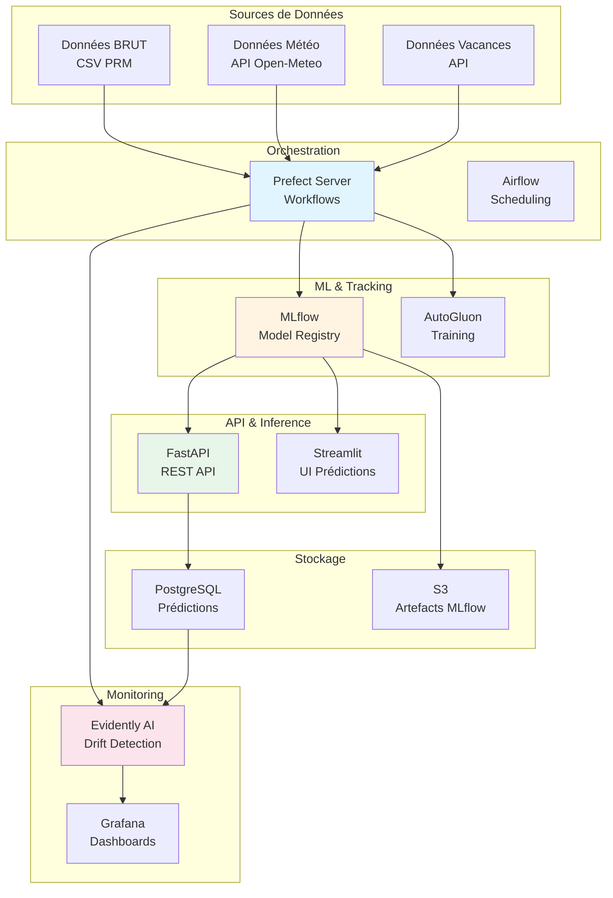

### 1.2 Architecture détaillée des services

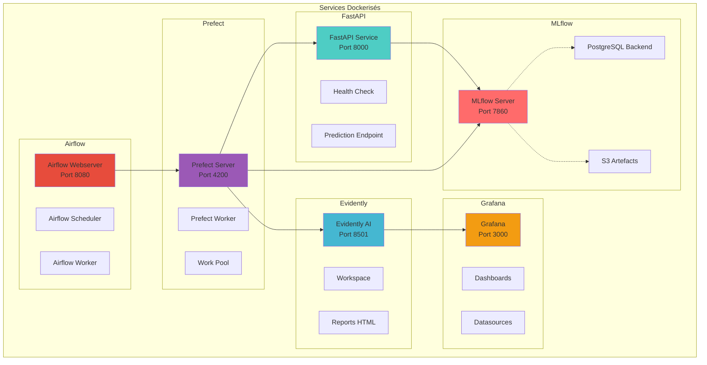

---

## 2. Flux de Données

### 2.1 Pipeline de données complet

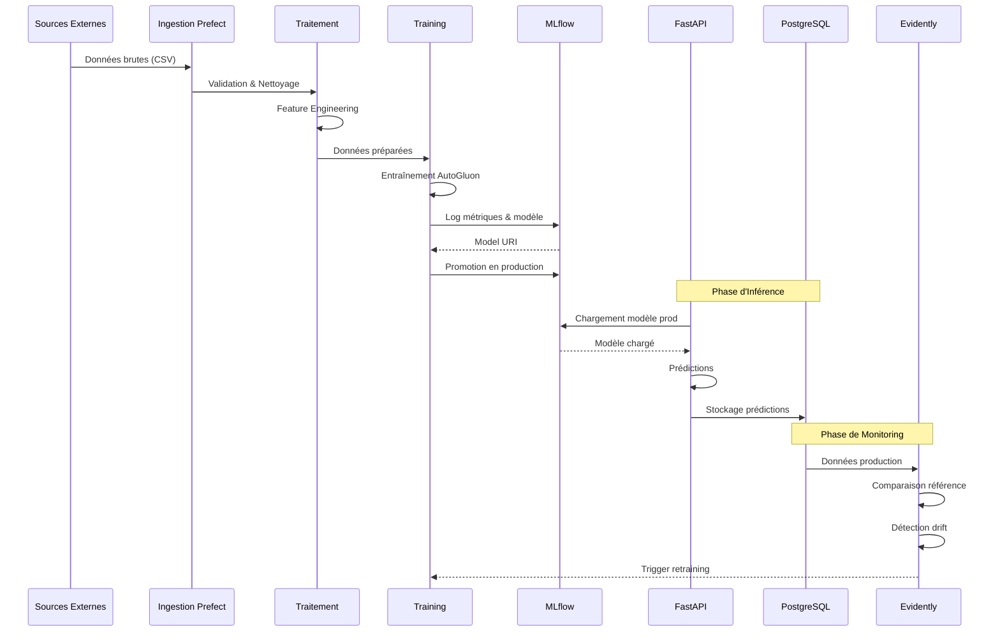

### 2.2 Flux de données d'entraînement

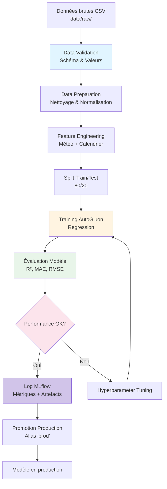

### 2.3 Flux de données d'inférence

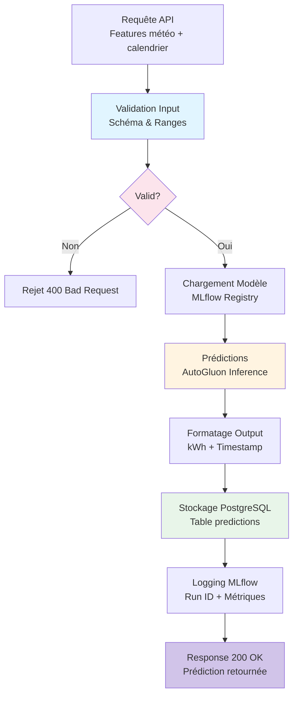

---

## 3. Pipeline d'Entraînement

### 3.1 Workflow Prefect d'entraînement

```mermaid
flowchart TD
    subgraph "Consumption Flow"
        A1[setup_training_task<br/>Config MLflow + DB] --> A2[load_data_task<br/>Chargement CSV]
        A2 --> A3[validate_data_task<br/>Validation schéma]
        A3 --> A4[prepare_data_task<br/>Nettoyage + Features]
        A4 --> A5[train_model_task<br/>AutoGluon Training]
        A5 --> A6[evaluate_model_task<br/>Métriques R², MAE]
        A6 --> A7[log_to_mlflow_task<br/>Log artefacts]
        A7 --> A8[promote_to_prod_task<br/>Alias prod]
    end
    
    subgraph "Solar Production Flow"
        B1[setup_training_task] --> B2[load_data_task]
        B2 --> B3[validate_data_task]
        B3 --> B4[prepare_data_task<br/>+ Irradiance]
        B4 --> B5[train_model_task]
        B5 --> B6[evaluate_model_task<br/>R² >= 0.92]
        B6 --> B7[log_to_mlflow_task]
        B7 --> B8[promote_to_prod_task]
    end
    
    style A1 fill:#e1f5ff
    style A5 fill:#fff4e1
    style A7 fill:#d1c4e9
    style B5 fill:#fff4e1
    style B7 fill:#d1c4e9
```

### 3.2 Pipeline d'entraînement détaillé

```mermaid
graph LR
    subgraph "Phase 1: Préparation"
        P1[Chargement Config] --> P2[Connexion MLflow]
        P2 --> P3[Chargement Données]
        P3 --> P4[Validation]
        P4 --> P5[Nettoyage]
        P5 --> P6[Feature Engineering]
    end
    
    subgraph "Phase 2: Training"
        P6 --> T1[Split Train/Test]
        T1 --> T2[AutoGluon Fit]
        T2 --> T3[Hyperparameter Tuning]
        T3 --> T4[Best Model Selection]
    end
    
    subgraph "Phase 3: Évaluation"
        T4 --> E1[Calcul Métriques]
        E1 --> E2[R² >= 0.90?]
        E2 -->|Oui| E3[Validation OK]
        E2 -->|Non| E4[Retrying]
    end
    
    subgraph "Phase 4: Déploiement"
        E3 --> D1[Log MLflow]
        D1 --> D2[Save Model]
        D2 --> D3[Register Model]
        D3 --> D4[Promote to Prod]
    end
    
    style P1 fill:#e1f5ff
    style T2 fill:#fff4e1
    style E2 fill:#fce4ec
    style D4 fill:#e8f5e9
```

---

## 4. Pipeline d'Inférence

### 4.1 Workflow Prefect de prédiction

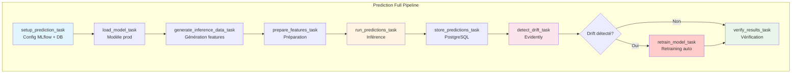

### 4.2 Variants de pipelines d'inférence

```mermaid
graph TB
    subgraph "prediction_full_pipeline"
        F1[Config] --> F2[Modèle]
        F2 --> F3[Données]
        F3 --> F4[Prédictions]
        F4 --> F5[Stockage BD]
        F5 --> F6[Drift Detection]
        F6 --> F7[Retraining]
        F7 --> F8[Vérification]
    end
    
    subgraph "prediction_inference_only_pipeline"
        I1[Config] --> I2[Modèle]
        I2 --> I3[Données existantes]
        I3 --> I4[Prédictions]
        I4 --> I5[Output direct]
    end
    
    subgraph "prediction_batch_pipeline"
        B1[Config] --> B2[Modèle]
        B2 --> B3[Batch 1]
        B3 --> B4[Batch 2]
        B4 --> B5[Batch N]
        B5 --> B6[Stockage BD]
    end
    
    style F1 fill:#e1f5ff
    style I1 fill:#fff4e1
    style B1 fill:#e8f5e9
```

---

## 5. Pipeline CI/CD

### 5.1 Pipeline GitHub Actions

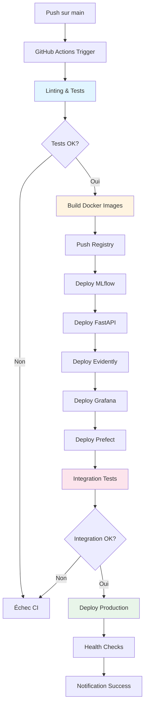

### 5.2 Workflow de déploiement

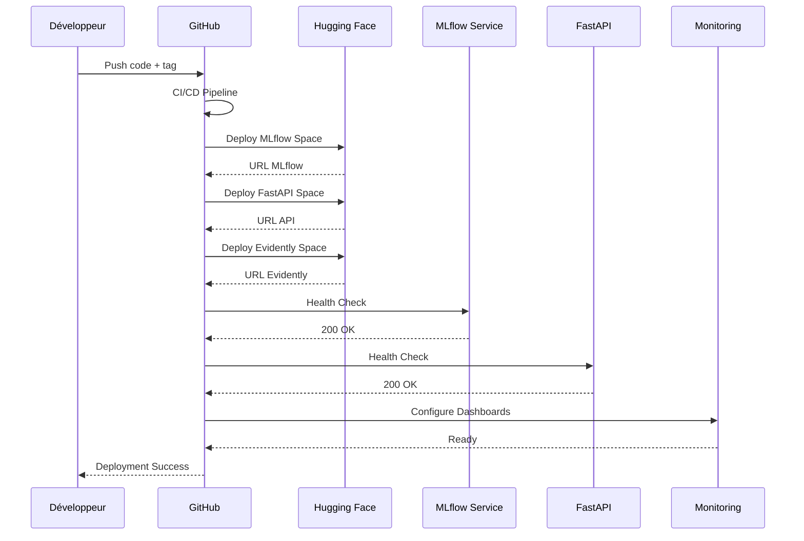

---

## 6. Monitoring et Drift Detection

### 6.1 Architecture de monitoring

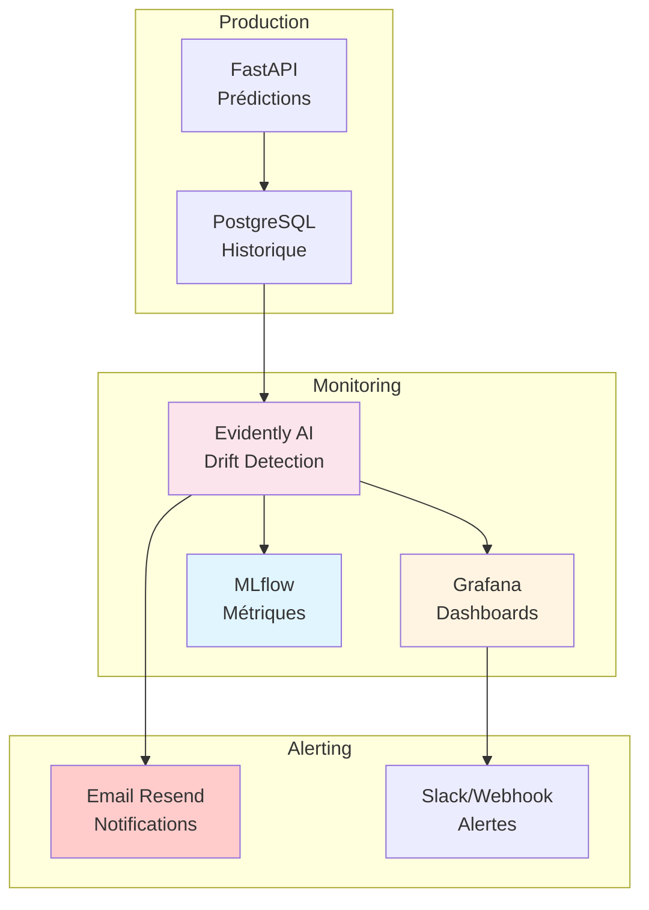

### 6.2 Pipeline de détection de drift

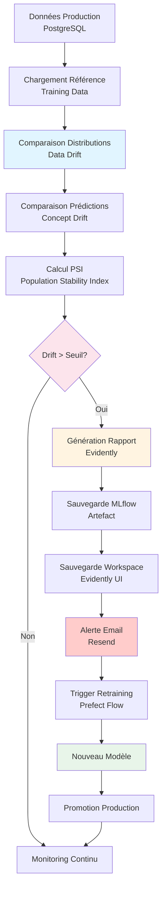

### 6.3 Métriques monitoring et seuils

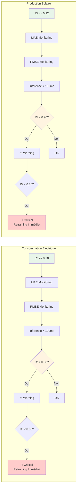

---

## 7. Automatisation du Retraining

### 7.1 Triggers de retraining

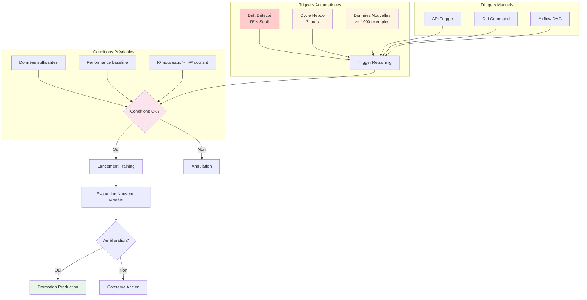

### 7.2 Workflow de retraining automatisé

```mermaid
sequenceDiagram
    participant Monitor as Evidently
    participant Trigger as Prefect Trigger
    participant Train as Training Flow
    participant MLflow as MLflow
    participant Eval as Evaluation
    participant Prod as Production
    
    Monitor->>Monitor: Détection Drift
    Monitor->>Trigger: Signal Retraining
    Trigger->>Train: Lancement Flow
    Train->>Train: Chargement Données
    Train->>Train: Training AutoGluon
    Train->>MLflow: Log Nouveau Modèle
    MLflow-->>Train: Model URI
    Train->>Eval: Évaluation
    Eval->>Eval: Comparaison Baseline
    Eval-->>Train: Résultats
    Train->>Train: Décision Promotion
    Train->>MLflow: Promotion Prod
    MLflow-->>Prod: Nouveau Modèle
    Prod->>Prod: Déploiement
    Prod-->>Monitor: Monitoring Continu
    
    style Monitor fill:#fce4ec
    style Train fill:#fff4e1
    style MLflow fill:#e1f5ff
    style Prod fill:#e8f5e9
```

---

## 8. Structure du Code

### 8.1 Organisation des modules

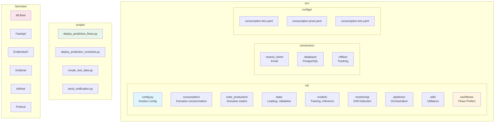

### 8.2 Différenciation par configuration

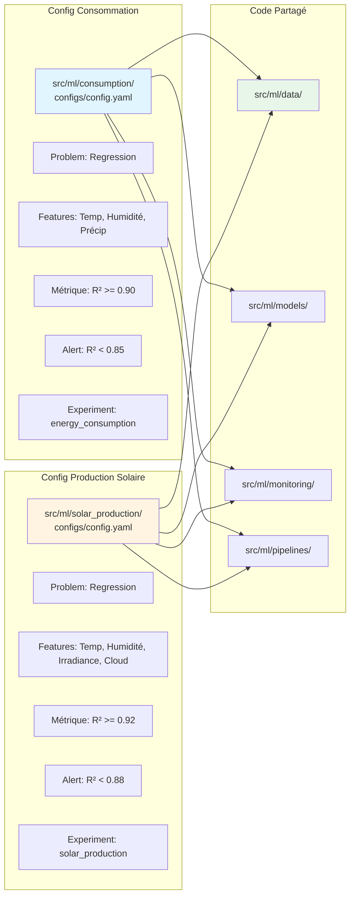

---

## 9. Conformité au Cahier des Charges

### 9.1 Mapping Objectifs → Implémentation

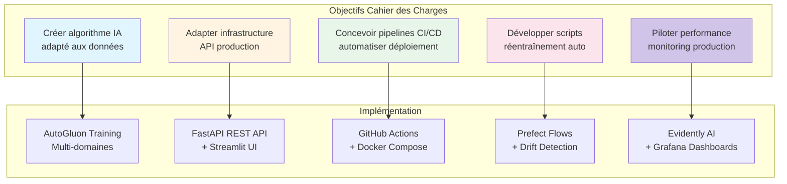

### 9.2 Spécifications techniques respectées

| Spécification | Implémentation | Statut |
|---------------|----------------|--------|
| **Algorithmes IA** | AutoGluon (regression) pour consommation et production solaire | ✅ |
| **Métriques** | R² >= 0.90 (consommation), R² >= 0.92 (solaire) | ✅ |
| **Temps inférence** | < 100ms par requête (FastAPI) | ✅ |
| **API Production** | FastAPI avec endpoints /predict et /predict/batch | ✅ |
| **CI/CD** | GitHub Actions avec Docker + Hugging Face Spaces | ✅ |
| **Réentraînement auto** | Prefect flows avec triggers drift + cycle hebdo | ✅ |
| **Monitoring** | Evidently AI + Grafana dashboards | ✅ |
| **Alertes** | Email via Resend + Slack webhooks | ✅ |
| **Stockage modèles** | MLflow Model Registry avec promotion prod | ✅ |
| **Données** | PostgreSQL pour prédictions, S3 pour artefacts | ✅ |

---

## 10. Résumé des Flows Principaux

### 10.1 Flows Prefect disponibles

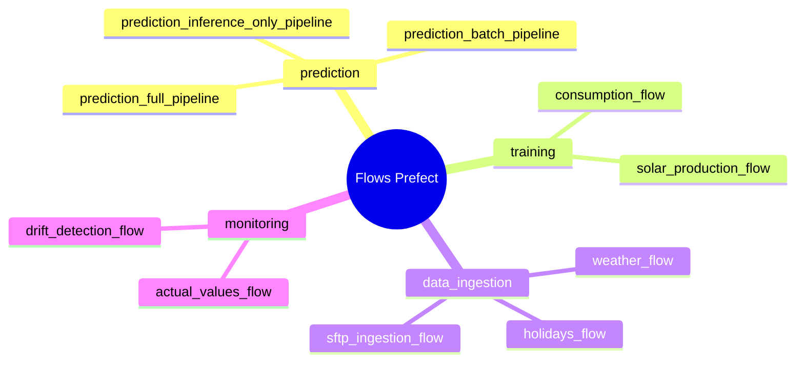

### 10.2 Services déployés

```mermaid
mindmap
  root((Services))
    MLOps_Core
      MLflow
      Prefect
      Airflow
    Inference
      FastAPI
      Streamlit
    Monitoring
      Evidently_AI
      Grafana
    Storage
      PostgreSQL
      S3
    Notification
      Resend_Email
```

---

## Conclusion

Cette architecture MLOps complète respecte l'intégralité du cahier des charges en :

1. **Créant des algorithmes IA adaptés** : AutoGluon avec configurations spécifiques par domaine (consommation, production solaire)
2. **Adaptant l'infrastructure** : API FastAPI pour production, avec UI Streamlit pour accessibilité
3. **Concevant des pipelines CI/CD** : GitHub Actions automatisant le déploiement sur Hugging Face Spaces
4. **Développant des scripts de réentraînement** : Flows Prefect avec triggers automatiques (drift, cycle hebdo)
5. **Pilotant la performance** : Evidently AI pour drift detection + Grafana pour monitoring continu

L'architecture est modulaire, scalable et conforme aux meilleures pratiques MLOps, avec une séparation claire des responsabilités entre les différents services.
